# Specification

## Key Components

To meet the system requirements, the following microservices are required:

### API Gateway / Load Balancer

- Acts as the entry point for all HTTP requests
- Routes incoming requests to the appropriate internal services
- Handles load balancing to support horizontal scaling

### Authentication System

- **Auth Service**: Responsible for validating user identity and authorizations
- **User Database**: Stores user credentials and profile information
- Handles the following actions:
  - **Login**: Issues access tokens to authenticated users
  - **Token Verification**: Validates tokens and provides essential user information for downstream services

### Application System

- **Application Service**: Handles user actions within the application (e.g., tracking actions that award points)
  - Records user activities that contribute to scoring
- **Application Database**: Stores application-specific user activity data
- **Score Service** (sub-component of Application System):
  - Modifies the user's score based on application service requests
  - Updates the top 10 scores in Redis cache
  - Exposes an API to retrieve the leaderboard from cache
- **Score Database**: Stores all user score data
- **Redis Cache**: Stores the leaderboard for fast retrieval

### Real-time System

- **WebSocket Server**: Subscribes to leaderboard change events and emits real-time updates to connected clients

### Message Queue

- Manages event-based communication across services
- Includes two main topics:
  - `calculate-leaderboard-topic`
  - `change-leaderboard-topic`

## Data Flow

1. The user sends a "complete action" request to the API Gateway.
2. The Gateway forwards the request to the Auth Service to verify the token.
3. If the token is valid, the Gateway routes the request to the Application Service.
4. The Application Service processes the request and stores relevant data in the Application Database.
5. It then sends a gRPC request to the Score Service to update the user's score.
6. The Score Service:
   - Updates the Score Database
   - Publishes an event to the `calculate-leaderboard-topic`
   - Returns a response to the Application Service
7. The Score Service consumes the `calculate-leaderboard-topic` message:
   - Retrieves data from the Score Database
   - Recalculates the leaderboard
   - If the leaderboard changes:
     - Updates the Redis cache
     - Publishes an event to the `change-leaderboard-topic`
8. The WebSocket Server consumes messages from the `change-leaderboard-topic` and emits the updated leaderboard to clients in real time.

## Data Flow Diagram

## System Architecture Diagram

```mermaid
graph TD
    %% External
    User[👤 User/Client]
    WebClient[🌐 WebSocket Client]
    
    %% API Gateway Layer
    Gateway[🚪 API Gateway<br/>Load Balancer]
    
    %% Authentication System
    AuthService[🔐 Auth Service]
    UserDB[(👥 User Database)]
    
    %% Application System
    AppService[⚙️ Application Service]
    AppDB[(📊 Application Database)]
    ScoreService[🏆 Score Service]
    ScoreDB[(🎯 Score Database)]
    RedisCache[(⚡ Redis Cache<br/>Leaderboard)]
    
    %% Real-time System
    WSServer[📡 WebSocket Server]
    
    %% Message Queue
    MQ[📨 Message Queue]
    CalcTopic[📋 calculate-leaderboard-topic]
    ChangeTopic[📢 change-leaderboard-topic]
    
    %% User interactions
    User -->|Complete Action Request| Gateway
    WebClient -->|WebSocket Connection| WSServer
    
    %% API Gateway routing
    Gateway -->|Token Verification| AuthService
    Gateway -->|Route Request| AppService
    
    %% Auth System
    AuthService <-->|User Credentials| UserDB
    
    %% Application flow
    AppService -->|Store Activity Data| AppDB
    AppService -->|gRPC: Update Score| ScoreService
    
    %% Score Service operations
    ScoreService -->|Update Score| ScoreDB
    ScoreService -->|Publish Event| CalcTopic
    ScoreService -->|Consume Event| CalcTopic
    ScoreService -->|Retrieve Data| ScoreDB
    ScoreService -->|Update Cache| RedisCache
    ScoreService -->|Publish Change| ChangeTopic
    
    %% Real-time updates
    WSServer -->|Consume Events| ChangeTopic
    WSServer -->|Real-time Updates| WebClient
    
    %% Message Queue connections
    CalcTopic -.-> MQ
    ChangeTopic -.-> MQ
    
    %% Styling
    classDef userClass fill:#e1f5fe,stroke:#0277bd,stroke-width:2px
    classDef gatewayClass fill:#f3e5f5,stroke:#7b1fa2,stroke-width:2px
    classDef authClass fill:#e8f5e8,stroke:#2e7d32,stroke-width:2px
    classDef appClass fill:#fff3e0,stroke:#ef6c00,stroke-width:2px
    classDef dbClass fill:#fce4ec,stroke:#c2185b,stroke-width:2px
    classDef realtimeClass fill:#e0f2f1,stroke:#00695c,stroke-width:2px
    classDef mqClass fill:#f1f8e9,stroke:#558b2f,stroke-width:2px
    
    class User,WebClient userClass
    class Gateway gatewayClass
    class AuthService,UserDB authClass
    class AppService,AppDB,ScoreService,ScoreDB,RedisCache appClass
    class WSServer realtimeClass
    class MQ,CalcTopic,ChangeTopic mqClass
```

